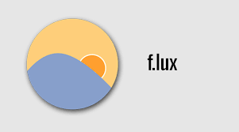

# F.lux: Enhancing Screen Comfort

**F.lux** automatically adjusts your screen's color temperature based on the time of day to reduce eye strain and improve sleep quality. Download the latest version from the official website for a healthier viewing experience.

  

  

F.lux is a free, user-friendly application designed to enhance your computer screen's comfort by adjusting its color temperature according to the time of day. By automatically transitioning your display from bright, cool light during the day to a warmer, softer hue at night, F.lux aims to reduce eye strain and improve sleep quality. This dynamic adjustment helps to mimic natural light patterns, making extended computer use more comfortable and less disruptive to your sleep cycle.

## Advantages

1. **Reduces Eye Strain**: Automatically adjusts screen color temperature to reduce eye strain during prolonged computer use.

2. **Improves Sleep Quality**: Lowers blue light exposure in the evening, helping you fall asleep more easily and improve sleep quality.

3. **Automatic Adjustment**: Changes screen color based on the time of day and your location to match natural lighting conditions.

4. **Customizable Settings**: Easily adjust color temperatures and transition schedules to fit your personal preferences.

5. **User-Friendly Interface**: Simple and intuitive interface allows for quick setup and management of settings.

6. **Optimizes Reading and Work**: Warmer light in the evening makes text easier to read and more comfortable for working with documents.

7. **Free to Use**: F.lux is available for free, offering all its features without any cost.
# How to Download F.lux

Downloading F.lux from the official website ensures security and reliability, as the application is directly provided by the F.lux developers. Utilizing the official website as a distribution platform guarantees that you are obtaining an authentic version of the software without the risk of downloading fake or malicious programs. Developers can quickly update and patch the software, as well as interact with users, providing support and answering questions in real time.

  

